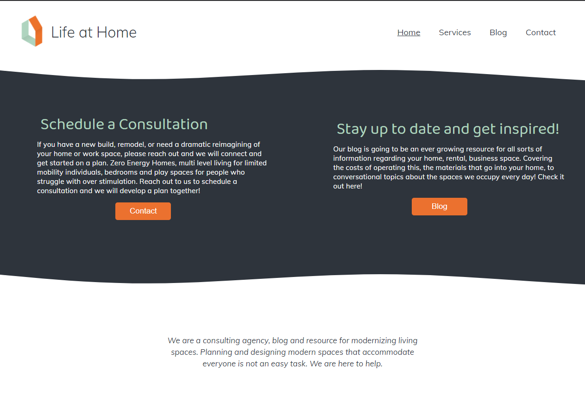
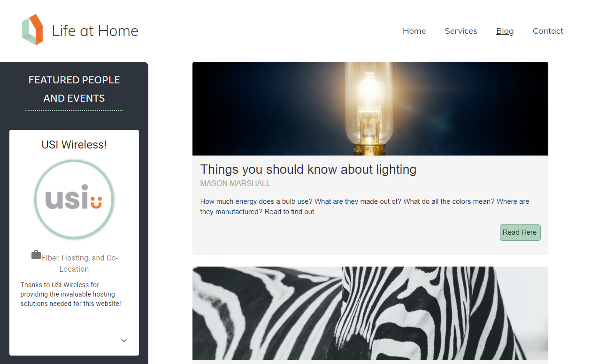
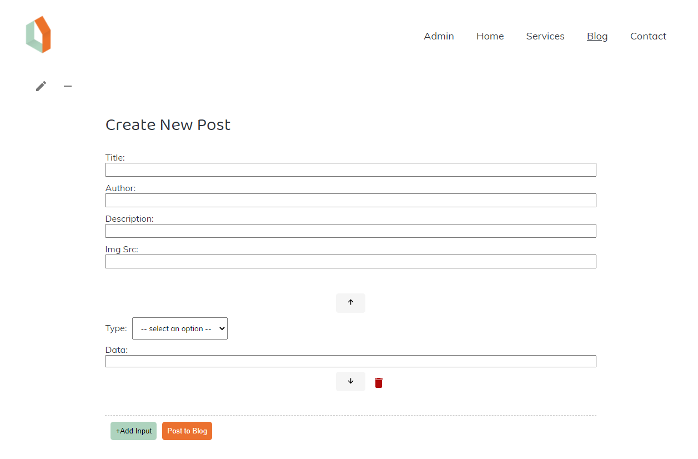

## MERN Stack Professional Website and Blog

## Table of Contents
* [Description](README.md#Description)
* [Setup](README.md#Setup)
* [Technologies](README.md#Technologies)
* [Contributors](READ.md#Contributors)
* [License](README.md#License)

## Description
Customizable website template which allows client to post to multiple pages and edit boxes on the home page. 
The contact page includes an email form and an easy to use Canlendly form. 
The Blog page supports embedded videos and links in the body of the post, and any users can add comments and reply to comments.

## Setup
Clone Repo and install dependencies in root directory. 
Create ".env" file and set "MONGODB_URI" to string of personal database collection.
In root directory run "npm run start", on first boot the database will be created and the page must be refreshed. 
Manager path = 'localhost:3000/#/manager' 
Default Username and Password both set to "Admin"
Once logged in, all pages gain edit and post functionality.
Add Calendly Link on line 24 of client/src/pages/Contact/index.js  

## Technologies
React, MongoDB, Node, Express, Axios, Calendly, Sass, Material-UI, Bcrypt, Email-Js

### Screenshots 

## Deployed Link
[Deployed Link](https://boiling-anchorage-71498.herokuapp.com/)

## Contributors
* Kelsey Sanderson [Github](https://github.com/kelseysanderson)  [Email](mailto:kelseyschreifels@gmail.com)
* Eric Heltemes [Github](https://github.com/erheltemes)  [Email](mailto:e.heltemes83@gmail.com)

## License
Read more about the license here:
https://opensource.org/licenses/MIT
